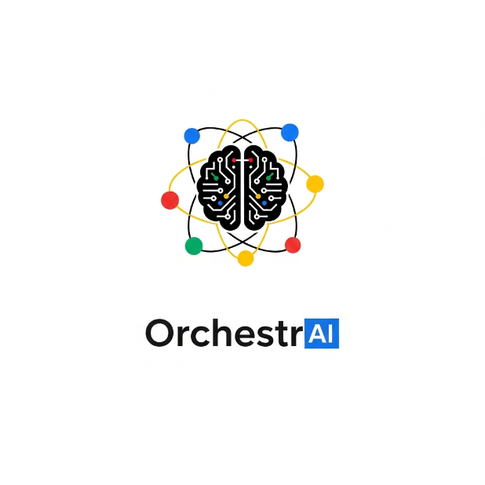
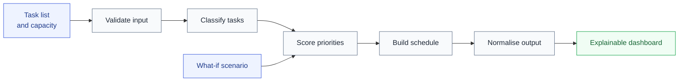

<div align="center">
  

  <h1>OrchestrAI</h1>

  <p><strong>Explainable AI workload planning for real-world constraints.</strong></p>
  <p>Turn competing tasks, deadlines and limited capacity into a ranked, transparent action plan.</p>

  <p>
    
    
    
    
  </p>
  <p>
    
    
    
  </p>

  <p>
    <a href="#quick-start"><strong>Quick start</strong></a> ·
    <a href="#how-it-works"><strong>Architecture</strong></a> ·
    <a href="#api"><strong>API</strong></a> ·
    <a href="#tests"><strong>Tests</strong></a>
  </p>
</div>

---

## From task list to decision-ready plan

Traditional to-do applications record decisions; they rarely help make them. OrchestrAI evaluates each task across **urgency, effort, importance, strategic value, flexibility and workload fit**, then explains why the resulting plan makes sense.

> [!NOTE]
> OrchestrAI works immediately in **local demo mode**, without an API key. Add Gemini when you want model-generated classification, explanations and richer what-if reasoning.

| Input | Reasoning pipeline | Output |
|---|---|---|
| Tasks, types and deadlines | Validate → classify → score → schedule → explain | Ranked priorities |
| Estimated effort | Capacity and overload analysis | Day-by-day action plan |
| Available hours | Six-factor scoring | Risks and defer suggestions |
| Optional scenario | Scenario-aware replanning | Interactive analytics |

## Product experience

| 🎓 Student | 🏥 Hospital | ⚖️ Law firm | 💻 Software team |
|---|---|---|---|
| Assignments, exams and certifications | Critical care, procedures and compliance | Court deadlines, filings and research | Bugs, features, security and technical debt |

The dashboard includes:

- explainable priority scores for every task;
- capacity-aware scheduling and overload detection;
- what-if scenario simulation;
- plan-readiness and risk summaries;
- urgency-versus-effort, weekly-capacity and score-breakdown charts; and
- a visible five-stage processing trace.

## How it works



Classification and planning use Gemini when configured. Validation, response normalisation, the local demo engine and interface rendering are deterministic application stages.

## Why it stands out

- **Explainable by design** — each ranking includes a plain-language reason.
- **Capacity aware** — the engine identifies when the requested workload cannot fit.
- **Useful without credentials** — the transparent local engine supports immediate evaluation.
- **Defensive LLM integration** — task text is treated as untrusted prompt data and model output is normalised.
- **Multi-domain** — the same orchestration pattern adapts to four operational settings.
- **Deployment ready** — includes Gunicorn, Docker health checks and a non-root container user.

## Technology

`Python` · `Flask` · `Google Gen AI SDK` · `Gemini 2.5 Flash` · `JavaScript` · `Chart.js` · `Gunicorn` · `Docker`

## Quick start

### macOS — one click

1. Download or clone this repository.
2. Double-click **`Start OrchestrAI.command`**.
3. Keep the Terminal window open while using the application.

The launcher creates a virtual environment, installs dependencies, starts the service and opens <http://127.0.0.1:8080>.

### Manual setup

```bash
git clone https://github.com/megh267/OrchestrAI.git
cd OrchestrAI
python3 -m venv .venv
source .venv/bin/activate
pip install -r requirements.txt
python main.py
```

Open <http://127.0.0.1:8080>.

### Optional Gemini configuration

```bash
export GEMINI_API_KEY="your-key"
export GEMINI_MODEL="gemini-2.5-flash"
python main.py
```

You may instead create a local `.env` file from `.env.example`; the macOS launcher loads it automatically. Never commit a real API key.

## Run with Docker

```bash
docker build -t orchestrai .
docker run --rm -p 8080:8080 orchestrai
```

To enable Gemini:

```bash
docker run --rm -p 8080:8080 \
  -e GEMINI_API_KEY="your-key" \
  orchestrai
```

## API

### `POST /prioritise`

```json
{
  "domain": "software",
  "available_hours": 12,
  "scenario": "What if a four-hour production issue arrives tomorrow?",
  "tasks": [
    {
      "title": "Fix production login bug",
      "type": "Critical bug",
      "due_in_days": "Today",
      "effort_hours": 3
    }
  ]
}
```

The endpoint accepts 1–20 uniquely named tasks and returns validated rankings, an action plan, risk indicators, chart data and a pipeline trace.

### `GET /health`

Returns the service status, active mode, configured model and pipeline-stage count. API keys are never returned.

## Tests

```bash
python -m unittest discover -s tests -v
```

The eight tests cover input validation, demo mode, API failure behaviour, model-output normalisation and security headers without making live model calls.

## Security and reliability

- API keys remain server-side and are excluded from Git.
- Browser input is restricted by length, range, supported domain and task count.
- User text is explicitly delimited as untrusted prompt data.
- Unknown task titles and categories are removed from model responses.
- Dynamic content is escaped before browser rendering.
- Same-origin requests replace permissive cross-origin access.
- Defensive browser headers are added to application responses.

> [!IMPORTANT]
> OrchestrAI is a decision-support demonstration. It must not be the sole basis for medical, legal, employment or other high-impact decisions.

## Project structure

```text
OrchestrAI/
├── main.py                    # API, validation and planning pipeline
├── static/index.html          # Responsive dashboard
├── tests/test_app.py          # Automated API and validation tests
├── Start OrchestrAI.command   # One-click macOS launcher
├── Dockerfile                 # Production container configuration
└── requirements.txt           # Python dependencies
```

## Roadmap

- Structured model schemas and richer evaluation datasets
- Authentication, persistence and user-specific planning history
- Rate limiting and observability
- Constraint-solver integration for schedule feasibility
- Shareable plans and export to calendar

---

<div align="center">
  <p>Designed and built as an AI engineering portfolio project.</p>
  <p><strong>© 2026 OrchestrAI contributors · No open-source licence has been granted.</strong></p>
</div>
