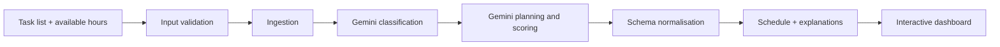

# OrchestrAI

**Explainable, scenario-aware workload planning powered by Gemini.**

OrchestrAI converts a list of competing tasks and a fixed capacity into a ranked, explainable action plan. Instead of sorting only by deadline, it evaluates urgency, effort, importance, strategic value, flexibility and workload fit—then lets the user test what-if scenarios before committing to a plan.


## Why this project exists

Traditional to-do applications record decisions; they rarely help make them. OrchestrAI explores how a small, auditable AI pipeline can support prioritisation while keeping the final decision with the user.

The interface supports four example domains:

- student workload;
- hospital operations;
- legal casework; and
- software delivery.

> OrchestrAI is a decision-support demonstration. It must not be used as the sole basis for medical, legal, employment or other high-impact decisions.

## Core capabilities

- Multi-factor task ranking with plain-language explanations
- Capacity-aware scheduling and overload detection
- What-if scenario simulation
- Domain-specific task categories
- Readiness, risk, urgency/effort and capacity visualisations
- A visible five-stage pipeline for ingestion, classification, scoring, scheduling and explanation
- Strict input validation and normalisation of model-generated JSON
- Prompt-injection boundaries for user-supplied task and scenario text
- Responsive interface with accessible status and error feedback

## Architecture



The displayed pipeline contains five logical stages. Classification and planning/scoring use Gemini; ingestion, validation, response normalisation and presentation are deterministic application stages.

## Technology

- Python and Flask
- Google Gen AI SDK with Gemini 2.5 Flash by default
- Vanilla HTML, CSS and JavaScript
- Chart.js
- Gunicorn and Docker

## Run locally

### Fastest option on macOS

Double-click **`Start OrchestrAI.command`**. On first use it creates a local Python environment, installs the required packages, starts the service and opens the correct browser address.

The application includes a transparent local demo engine, so it works without an API key. Configure Gemini only when you want model-generated classification, explanations and richer scenario reasoning.

### 1. Create an environment

```bash
python -m venv .venv
source .venv/bin/activate
pip install -r requirements.txt
```

### 2. Configure Gemini (optional)

```bash
export GEMINI_API_KEY="your-key"
```

Use `.env.example` as a reference if your deployment platform supports environment files. The one-click launcher also loads a local `.env` file when present. Do not commit a real API key.

Optionally choose a different compatible model:

```bash
export GEMINI_MODEL="gemini-2.5-flash"
```

### 3. Start the application

```bash
python main.py
```

Open <http://localhost:8080>.

## Run with Docker

```bash
docker build -t orchestrai .
docker run --rm -p 8080:8080 -e GEMINI_API_KEY="your-key" orchestrai
```

## API

### `POST /prioritise`

Example request:

```json
{
  "domain": "software",
  "available_hours": 12,
  "scenario": "What if a four-hour production issue arrives tomorrow?",
  "tasks": [
    {
      "title": "Fix production login bug",
      "type": "Critical bug",
      "due_in_days": "Today",
      "effort_hours": 3
    }
  ]
}
```

The endpoint accepts 1–20 unique tasks. It returns validated rankings, an action plan, risk indicators, chart data and a pipeline trace.

### `GET /health`

Returns service status, configured model, pipeline-stage count and whether an API key is available. The key itself is never returned.

## Tests

```bash
python -m unittest discover -s tests -v
```

The tests cover payload validation, API error behaviour, output normalisation, prompt-data boundaries and security headers without making live model calls.

## Security and reliability choices

- The API key is read only from the server environment.
- Same-origin requests are used; permissive cross-origin access is not enabled.
- Input lengths, numeric ranges, supported domains and task counts are validated.
- Task and scenario content is explicitly delimited as untrusted prompt data.
- Only known task titles and domain categories survive model-output normalisation.
- Dynamic content is escaped before being inserted into the interface.
- Production responses include defensive browser headers.

## Limitations and next steps

- LLM rankings can still be incomplete or biased; they require human review.
- The current prototype has no user accounts or persistent task storage.
- Scheduling is generated in one planning pass rather than solved with a deterministic optimiser.
- A future version could add structured model schemas, evaluation datasets, authentication, rate limiting and a constraint solver for schedule feasibility.

## Portfolio note

This repository demonstrates product thinking, LLM orchestration, defensive API design, data visualisation and deployment readiness. If you reuse the concept, please credit the project and its contributors.

© 2026 OrchestrAI contributors. No open-source licence has been granted.
